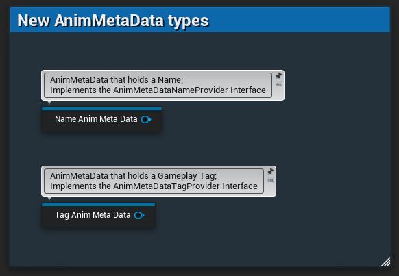
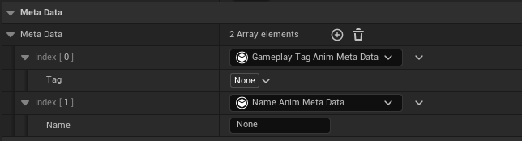
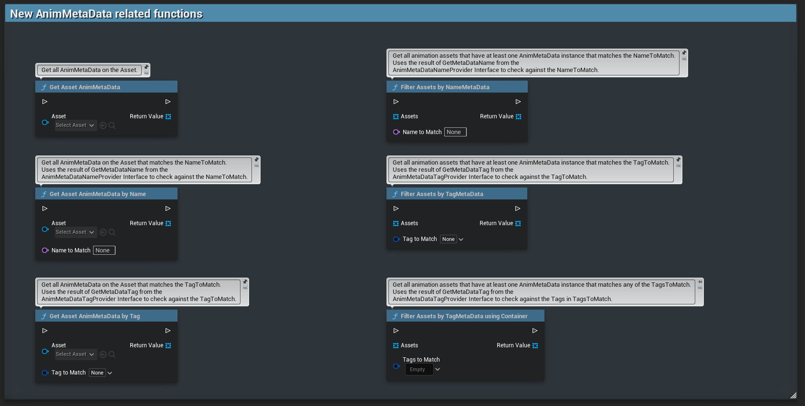

# Animation Metadata Kickstart for Unreal

Unreal already provides some basic support for AnimMetaData, but this is only very bare-bones.
So I decided to create this plugin, to give people a bit of a kickstart into using Unreals AnimMetaData.

## What even is AnimMetaData?
Well, glad you ask!
AnimMetaData are instanced objects that live on animation assets.
This means you can create a class that inherits from the AnimMetaData baseclass that unreal provides, give it some variables, and assign your metadata to animations in your project. If you exposed the variables of your AnimMetaData class, you will even be able to change them on a per-animation basis, since every animation has its own instance.

The issue is that unreal doesn't really provide any user-facing classes that would be ready to use.
You might have even already seen the MetaData section in the details panel of your animation assets, but never really cared about it because the only option you could assign there was "None".

Well Not Anymore!

# What does this plugin do?

Well, for one, it provides a few new AnimMetaData classes:

And accordingly, it also provides new functions that expose the metadata on animation assets to Blueprints.
With these new functions, you have some generically structured ways to query the metadata of your animation assets, or filter animation assets by whether they contain matching AnimMetaData or not

# How is this useful?
If you are dealing with any project of size, you will have likely found out that organizing, finding, and arranging animatons can be quite the hassle.

Assume for example you have a pool of weapon animations.
Now when you reload your weapon you have a pool for each to select from. But it should not be a random selection, but instead be contextual based on the state of your weapon. If the mag is empty, you want a separate reload from when there is some ammo left, and if it is full you just want to inspect the mag and put it back in.
Instead of making 3 separate states for this, you might rather want to use gameplay tags that the engineers have already set up to have convenient access to exactly that information.
You can add the relevant AnimMetaData to the animations in the editor, so all your animation blueprint needs to do is filter your reload anims for the relevant tag of the situation and voilà, your animation is ready to use.

But this is just one example concerning scalability of projects.

You could also create your own classes derived from the classes of this plugin to embed your own data into your animations, and use the query and filter functions this plugin provides at runtime.

Really it is meant as a generic starting point to get you started and provide some generic but useful functionality that I think might be applicable if you are willing to integrate AnimMetaData into your workflow.

Created and tested with UE5.4, but likely works with close other versions just as well.